## 安装webpack、webpack4

    yarn add webpack webpack-cli -D

## 创建配置目录结构

    config
        webpack.common.js
        webpack.dev.js
        webpack.prod.js

    scripts
        build.js  // 构建模式脚本
        start.js  // 开发模式脚本

    src
        index.js

    package.json

## 编写基本配置

- 配置启动脚本命令

    > package.json

        ...
        "license": "MIT",
        + "scripts": {
        +     "start": "node ./scripts/start.js",
        +     "build": "node ./scripts/build.js"
        + },
        "devDependencies": {
            "webpack": "^4.35.2",
            "webpack-cli": "^3.3.5"
        }
        ...

- 编写webpack配置, 以 `src/index.js` 作为主入口，以 `build`为打包后的目录

    > config/webpack.common.js

        const path = require('path');

        module.exports = {
            entry: "./src/index.js",
            output: {
                path: path.resolve(__dirname, "../build"),
                filename: "bundle.js"
            }
        }

    ***output path字段这里配置的绝对路径***

- 编写开发模式运行脚本

    > scripts/build.js

        const webpack = require('webpack');
        const webpackConfig = require('../config/webpack.common.js');

        webpack(webpackConfig, (err, stats) => {
            if(err || stats.hasErrors()){
                console.log("编译失败");
            }
        });

    ***webpack node接口文档： https://www.webpackjs.com/api/node/***

- 在入口编写一点内容

    > src/index.js

        console.log('hello')

- 执行 `yarn build` 命令，生成打包目录

    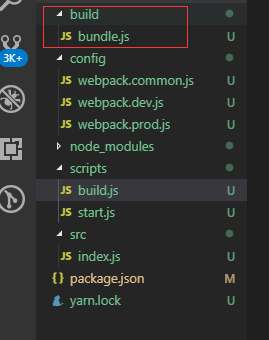

    运行生成的bundle.js

    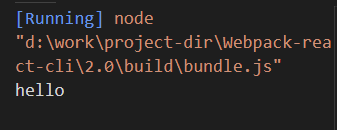

## 配置开发模式 - webpack-dev-server

- 安装

    yarn add webpack-dev-server webpack-merge -D

- 改写webpack配置文件, common文件导出一个可传参数的基本配置生成器, prod和dev文件使用webpack-merge将通用配置和各自模式下的配置进行合并导出

    > config/webpack.common.js

        const path = require('path');

        function webpackCommonConfigCreator(options){
            /**
            * options: 
            *      mode // 开发模式
            */

            return {
                mode: options.mode,
                entry: "./src/index.js",
                output: {
                    filename: "bundle.js",
                    path: path.resolve(__dirname, "../build"),
                }
            }
        }

        module.exports = webpackCommonConfigCreator;

    > config/webpack.prod.js

        const webpackConfigCreator = require('./webpack.common');
        const merge = require('webpack-merge');

        const config = {

        }

        const options = {
            mode: "production"
        }

        module.exports = merge(webpackConfigCreator(options), config);

    > config/webpack.dev.js

        const webpackConfigCreator = require('./webpack.common');
        const merge = require('webpack-merge');

        const config = {

        }

        const options = {
            mode: "development"
        }

        module.exports = merge(webpackConfigCreator(options), config);

    > script/build.js

        const webpack = require('webpack');
        const webpackConfig = require('../config/webpack.prod.js');

        webpack(webpackConfig, (err, stats) => {
            if(err || stats.hasErrors()){
                console.log("编译失败");
            }
        });

    ***`yarn build` 打包， 输出正常***

- 配置 webpack-dev-server

    > config/webpack.dev.js

        ...
        + const path = require('path');

        const config = {
            + devServer: {
            +     contentBase: path.join(__dirname, "../dist")
            + }
        }
        ...

    > scripts/start.js

        const webpack = require('webpack');
        const webpackDevServer = require('webpack-dev-server');
        const webpackConfig = require('../config/webpack.dev.js');

        const compiler = webpack(webpackConfig);
        const options = Object.assign({}, webpackConfig.devServer, {
            open: true
        })
        const server = new webpackDevServer(compiler, options);

        server.listen(3000, '127.0.0.1', () => {
            console.log('Starting server on http://localhost:8080');
        })

- 运行命令 `yarn start`, 浏览器自动弹出窗口，访问 `localhost:3000/bundle.js`

    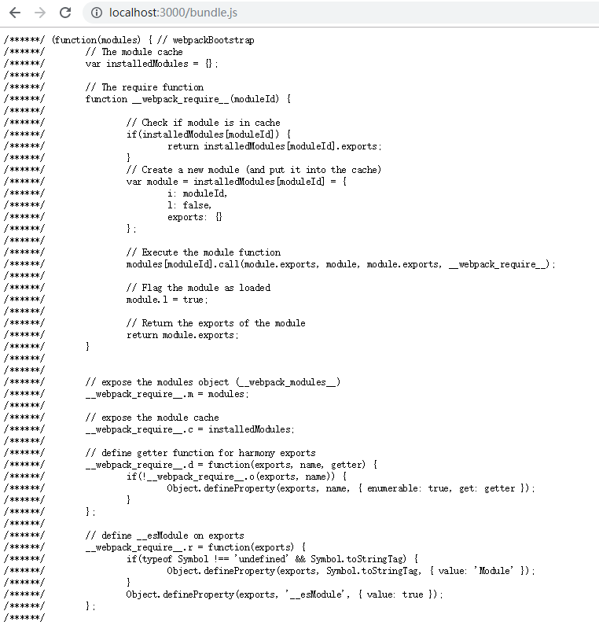

    

## 配置插件 `clean-webpack-plugin`、 `html-webpack-plugin`， 这两个插件基本上是必配的了 

- 简介

    - clean-webpack-plugin - 每次打包时清理上次打包生成的目录

        ***官网指南关于这个插件部分内容已经过时没有更新，按照官网配置会出错，所以参考github上这个插件文档来配置， 文档地址: https://github.com/johnagan/clean-webpack-plugin***

    - html-webpack-plugin - 生成打包文件中的 index.html

- 安装

    yarn add clean-webpack-plugin html-webpack-plugin -D

- 这两个插件在两种模式下都要用到，所以配置在common.js

    > config/webpack.common.js

        ...
        + const HtmlWebpackPlugin = require('html-webpack-plugin');
        + const { CleanWebpackPlugin } = require('clean-webpack-plugin');

        function webpackCommonConfigCreator(options){
            ...
            return {
                ...
                plugins: [
                    + new HtmlWebpackPlugin(),
                    + new CleanWebpackPlugin({
                    +     cleanOnceBeforeBuildPatterns: [path.resolve(process.cwd(), "build/"), path.resolve(process.cwd(), "dist/")]
                    + }),
                ]
            }
        }
        ...

    > src/index.js

        var ele = document.createElement('div');
        ele.innerHTML = "hello webpack";

        document.body.appendChild(ele);

- `yarn build`, build目录下生成index.html并且引入了bundle.js

- `yarn start`

    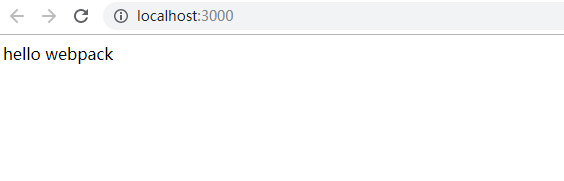

    ***build目录被删除，dist存于内存中, 更改index.js内容，浏览器将自动更新改动***

## 配置react

- 安装react

        yarn add react react-dom

- 安装babel

    yarn add @babel/core @babel/cli @babel/preset-env -D
    yarn add @babel/preset-react -D
    yarn add babel-loader -D

- 配置 babel-loader 

    > config/webpack.common.js

        ...
        function webpackCommonConfigCreator(options){
            ...
            return {
                ...
                + module: {
                +     rules: [
                +         {
                +             test: /\.(js|jsx)$/,
                +             include: path.resolve(__dirname, "../src"),
                +             use: [
                +                 {
                +                     loader: "babel-loader",
                +                     options: {
                +                         presets: ['@babel/preset-react'],
                +                     }
                +                 }
                +             ]
                +         }
                +     ]
                + },
                ...
            }
        }

- 编写基本的react文件

    > src/index.js

        import React from 'react';
        import ReactDom from 'react-dom';
        import App from './App.js';

        ReactDom.render(<App />, document.getElementById('root'));

    > src/App.js

        import React from 'react';

        function App(){
            return (
                

                    hello react
                

            )
        }

        export default App;

- App节点挂在在id为`root`的div上，而`html-webpack-plugin`插件默认生成的html没有这个div, 所以需要配置插件使用我们定义的模板

    ***创建public/index.html***

    > public/index.html

        <!DOCTYPE html>
        <html lang="en">
        <head>
            <meta charset="UTF-8">
            <meta name="viewport" content="width=device-width, initial-scale=1.0">
            <meta http-equiv="X-UA-Compatible" content="ie=edge">
            <title>react webpack</title>
        </head>
        <body>
            

        </body>
        </html>

    > config/webpack.common.js

        ...
        function webpackCommonConfigCreator(options){
            ...
            return {
                ...
                plugins: [
                    - new HtmlWebpackPlugin(),
                    + new HtmlWebpackPlugin({
                    +     template: path.resolve(__dirname, "../public/index.html")
                    + }),
                    ...
                ]
            }
        }

- `yarn start`

    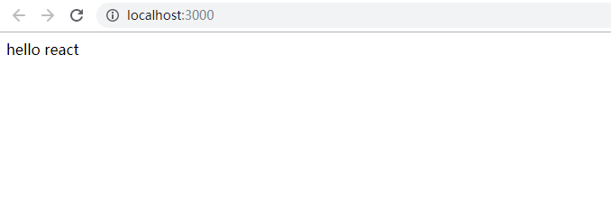

## react模块热替换

***开发模式下，改动代码，浏览器将刷新页面来更新改动，配置模块热替换，浏览器不刷新，而是通过dom操作来更新改动，对频繁更新代码的开发模式更加友好***

- 安装

    yarn add react-hot-loader -D

- 修改配置

    > config/webpack.common.js

        ...
        function webpackCommonConfigCreator(options){
            ...
            return {
                ...
                module: {
                    rules: [
                        {
                            test: /\.(js|jsx)$/,
                            include: path.resolve(__dirname, "../src"),
                            use: [
                                {
                                    loader: "babel-loader",
                                    options: {
                                        presets: ['@babel/preset-react'],
                                        + plugins: ["react-hot-loader/babel"],
                                    }
                                }
                            ]
                        }
                    ]
                },
                ...
            }
        }

- 修改react代码

    > src/App.js

        + import {hot} from 'react-hot-loader/root';
        ...
        export default hot(App);

- 开启webpackDevServer热加载

    > config/webpack.dev.js

        ...
        const config = {
            devServer: {
                contentBase: path.join(__dirname, "../dist"),
                + hot: true
            }
        }
        ...

## css

### 配置css

- 安装loader

    yarn add style-loader css-loader -D

- 配置loader

    > config/webpack.common.js

        ...
        function webpackCommonConfigCreator(options){
            ...
            return {
                ...
                module: {
                    rules: [
                        ...
                        + {
                        +     test: /\.css$/,
                        +     include: path.resolve(__dirname, '../src'),
                        +     use: ["style-loader", "css-loader"]
                        + }
                    ]
                },
                ...
            }
        }

    ***创建src/app.css***

    > src/app.css

        .text{
            font-size: 20px;
            color: brown;
        }

    > src/App.js

        + import './app.css';

        function App(){
            return (
                - 

                + 

                    hello react
                

            )
        }
        ...

- `yarn start`

    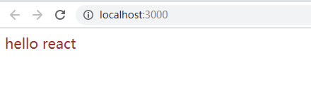

### 配置scss

- 安装

    yarn add sass-loader node-sass -D

- 配置loader

    > config/webpack.common.js

        ...
        function webpackCommonConfigCreator(options){
            ...
            return {
                ...
                module: {
                    rules: [
                        ...
                        {
                        -    test: /\.css/,
                        +    test: /\.(css|scss)$/,
                            include: path.resolve(__dirname, '../src'),
                        -    use: ["style-loader", "css-loader"]
                        +    use: ["style-loader", "css-loader", "sass-loader"]
                        }
                    ]
                },
                ...
            }
        }

    ***创建src/app.scss***

    > src/app.scss

        .title{
            font-size: 18px;
            font-weight: 800;
            color: #333;
            text-decoration: underline;
        }

    > src/App.js

        - import './app.css';
        + import './app.scss';

        function App(){
            return (
                - 

                + 

                    hello react
                

            )
        }
        ...

- `yarn start`

    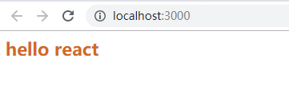

### 配置css-module

- 修改配置

    > config/webpack.common.js

        ...
        function webpackCommonConfigCreator(options){
            ...
            return {
                ...
                module: {
                    rules: [
                        ...
                        {
                            ...
                            - use: ["style-loader", "css-loader", "sass-loader"]
                            + use: [
                            +         "style-loader", 
                            +         {
                            +             loader: "css-loader",
                            +             options: {
                            +                 modules: {
                            +                     mode: "local",
                            +                     localIdentName: '[path][name]_[local]--[hash:base64:5]'
                            +                 },
                            +                 localsConvention: 'camelCase'
                            +             }
                            +         }, 
                            +         "sass-loader"
                            + ]
                        }
                    ]
                },
                ...
            }
        }

    > src/App.js

        - import './app.scss';
        + import styles from './app.scss';

        function App(){
            return (
                - 

                + 

                    hello react
                

            )
        }

        export default hot(App);

- `yarn start`

    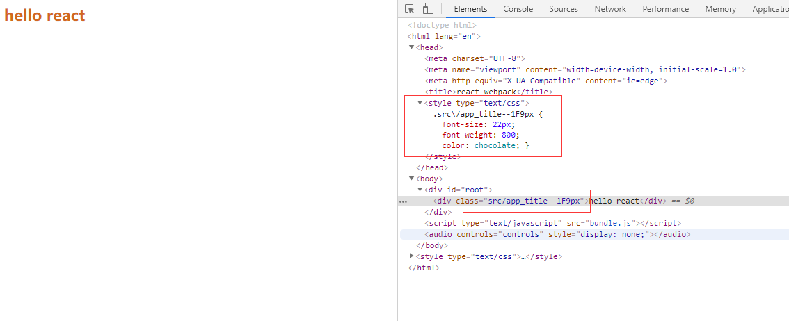

### 现在编译后的css由js动态内联在html中，需要分离到单独的文件

- 安装, 注意extract-text-webpack-plugin最新版才支持webpack4

    yarn add extract-text-webpack-plugin@next -D

- 配置 

    > config/webpack.common.js

        ...
        + const ExtractTextPlugin = require('extract-text-webpack-plugin');

        ...
        module: {
            rules: [
                ...
                {
                    test: /\.(css|scss)$/,
                    include: path.resolve(__dirname, '../src'),
                    - use: [
                    -     "style-loader", 
                    -     {
                    -         loader: "css-loader",
                    -         options: {
                    -             modules: {
                    -                 mode: "local",
                    -                 localIdentName: '[path][name]_[local]--[hash:base64:5]'
                    -             },
                    -             localsConvention: 'camelCase'
                    -         }
                    -     }, 
                    -     "sass-loader"
                    - ]
                    + use: ExtractTextPlugin.extract({
                    +     fallback: "style-loader",
                    +     use: [
                    +         {
                    +             loader: "css-loader",
                    +             options: {
                    +                 modules: {
                    +                     mode: "local",
                    +                     localIdentName: '[path][name]_[local]--[hash:base64:5]'
                    +                 },
                    +                 localsConvention: 'camelCase'
                    +             }
                    +         }, 
                    +         "sass-loader"
                    +     ]
                    + })
                },
                ...
            ]
        },
        plugins: [
            ...
            new ExtractTextPlugin({
                filename: "[name][hash].css"
            }),
        ]

- `yarn build`

    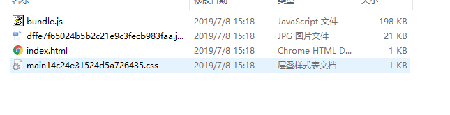

    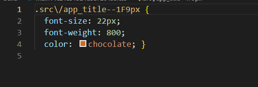

### 使用postcss对css3属性添加前缀

- 安装

    yarn add postcss-loader postcss-import autoprefixer -D

- 配置

    > config/webpack.common.js

        module: {
            rules: [
                ...
                {
                    test: /\.(css|scss)/,
                    use: ExtractTextPlugin.extract({
                        fallback: "style-loader",
                        use: [
                            ...
                            + {
                            +     loader: "postcss-loader",
                            +     options: {
                            +         ident: 'postcss',
                            +         plugins: loader => [
                            +             require('postcss-import')({ root: loader.resourcePath }),
                            +             require('autoprefixer')()
                            +         ]
                            +     }
                            + }
                        ]
                    })
                },
                ...
            ]
        }

### 对生产模式下css进行压缩

- 安装

    yarn add optimize-css-assets-webpack-plugin -D

- 配置

    > config/webpack.prod.js

        + const optimizeCss = require('optimize-css-assets-webpack-plugin');

        const config = {
            + plugins: [
            +     new optimizeCss({
            +         cssProcessor: require('cssnano'),
            +         cssProcessorOptions: { discardComments: { removeAll: true } },
            +         canPrint: true
            +     }),
            + ],
        }
        ...

- `yarn build`， 效果

    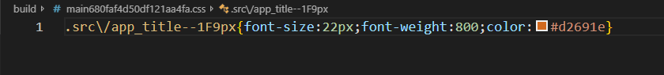

## 图片、字体

### 配置字体

- 安装

    yarn add file-loader -D

- 配置

    > config/webpack.common.js

        module: {
            rules: [
                ...
                + {
                +     test: /\.(woff|woff2|eot|ttf|otf)$/,
                +     use: ['file-loader']
                + },
            ]
        },

### 配置图片

- 安装

    yarn add url-loader -D

- 配置

    > config/webpack.common.js

        module: {
            rules: [
                ...
                + {
                +     test: /\.(jpg|png|svg|gif)$/,
                +     use: [
                +         {
                +             loader: 'url-loader',
                +             options: {
                +                 limit: 10240,
                +                 name: '[hash].[ext]',
                +             }
                +         },
                +     ]
                + },
            ]
        }

- 添加两张图片

    - src/assets/small.jpg -- `6kb`

    - src/assets/bigger.jpg -- `20kb`

- 引入图片

    > src/App.js

        + import small_pic from './assets/small.jpg';
        + import bigger_pic from './assets/bigger.jpg';

        function App(){
            return (
                

                    hello react

                    + 
                    + 
                

            )
        }

        export default hot(App);

- 效果

    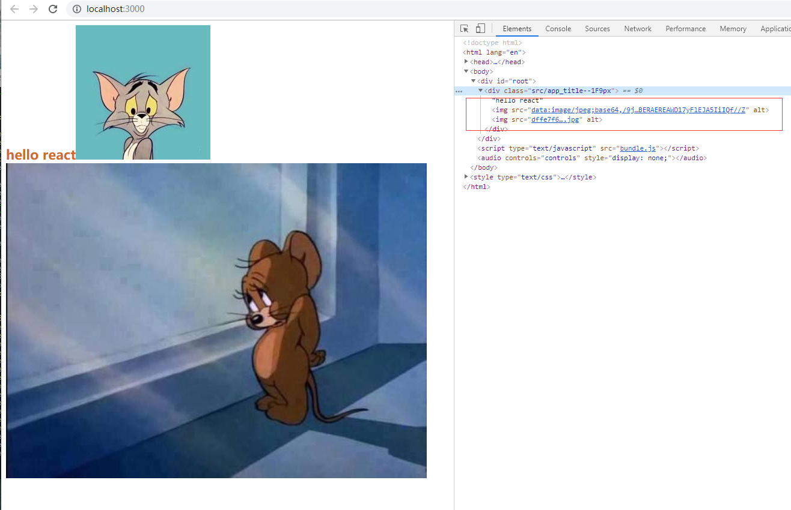

***可以看到，小于10k的图片编译成了base64格式，而大于10k的图片以链接形式赋值给src， 由url-loader的limit选项决定界限***

## 管理打包后目录结构

- 配置结构如下

        build/
            js/
                xxx.js
            css/
                xxx.css
            images/
                xxx.jpg
            index.html

- 修改配置

    > config/webpack.common.js

        function webpackCommonConfigCreator(options){
            ...
            return {
                ...
                output: {
                    - filename: "bundle.js",
                    + filename: "js/bundle.js",
                    path: path.resolve(__dirname, "../build"),
                },
                module: {
                    rules: [
                        ...
                        {
                            test: /\.(jpg|png|svg|gif)$/,
                            use: [
                                {
                                    loader: 'url-loader',
                                    options: {
                                        limit: 10240,
                                        - name: '[hash].[ext]',
                                        + name: 'images/[hash].[ext]',
                                    }
                                },
                            ]
                        },
                    ]
                },
                plugins: [
                    ...
                    new ExtractTextPlugin({
                        - filename: "[name][hash].css"
                        + filename: "css/[name][hash].css"
                    }),
                ]
            }
        }

    ***通过相对output目录对资源命名前加上目录名***

- `yarn build`

    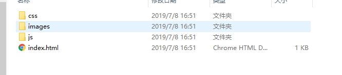

## 配置ant-design

- 安装 

    yarn add antd

- 为第三方包配置css解析，将样式表直接导出

    > config/webpack.common.js

        ...
        modules: {
            rules: [
                {
                    test: /\.(css|scss)$/,
                    include: path.resolve(__dirname, '../src'),
                    use: ExtractTextPlugin.extract({
                        ...
                    })
                },
                + {
                +     test: /\.(css|scss)$/,
                +     exclude: path.resolve(__dirname, '../src'),
                +     use: [
                +        "style-loader/url",
                +        {
                +            loader: 'file-loader',
                +            options: {
                +                name: "css/[name].css"
                +            }
                +        }
                +    ]
                + },
            ]
        }
        ...

- 使用antd组件

    - 引入antd样式表

        > src/index.js

            import React from 'react';
            import ReactDom from 'react-dom';
            import App from './App.js';
            + import 'antd/dist/antd.css';

            ReactDom.render(<App />, document.getElementById('root'));

    - 创建目录 `src/component`

        > src/component/Btn.js

            import React from 'react';
            import {Button} from 'antd';

            export default function Btn(){
                return (
                    

                        <Button type="danger">click me2</Button>
                    

                )
            }

    - 引入组件

        > src/App.js

            + import Btn from './components/Btn';

            function App(){
                return (
                    

                        ...
                        + <Btn />
                    

                )
            }
            ...

- `yarn start`，成功, 但是`bundle.js`体积非常的大，需要优化

    

## 分割bundle

- 配置

    > config/webpack.common.js

        function webpackCommonConfigCreator(options){
            return {
                ...
                output: {
                    - filename: "js/bundle.js",
                    + filename: "js/[name].js",
                    path: path.resolve(__dirname, "../build"),
                },
                ...
                + optimization: {
                +     splitChunks: {
                +         chunks: "all",
                +         minSize: 50000,
                +         minChunks: 1,
                +     }
                + }
            }
        }

- `yarn build`， 打包如下

    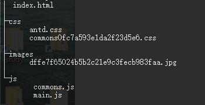

## 缓存

- 为了在每次修改代码后，浏览器都能获取到最新的js，通常会对output的名添加hash值

    > config/webpack.common.js

        output: {
            - filename: "js/[name].js",
            + filename: "js/[name][hash].js",
            path: path.resolve(__dirname, "../build"),
        },

- 效果

    - yarn build

        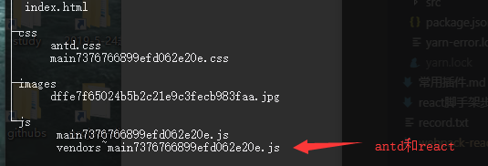

    - 修改开发代码后再次打包

        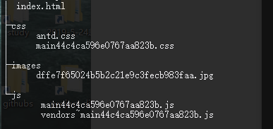

    ***可以看到修改代码后，打包的js文件名hash值变了，浏览器请求总能够获取到最新的代码***

- 但是分割出来的antd和react的代码没有变化，名字也变了，则浏览器也会再次请求这个模块，应该没有发生改变的模块保持名称以使浏览器从缓存中获取，在生产模式下使用`[chunkhash]`替代`[hash]`

    > config/webpack.common.js

        output: {
            - filename: "js/[name][hash].js",
            path: path.resolve(__dirname, "../build"),
        },

    > config/webpack.prod.js

        + output: {
        +    filename: "js/[name][chunkhash].js",
        + },

    > config/webpack.dev.js

        + output: {
        +    filename: "js/[name][hash].js",
        + },

- 效果

    - yarn build

        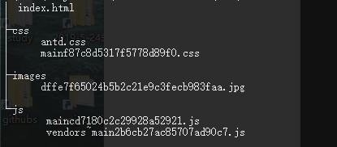

    - 修改开发代码后再次打包

        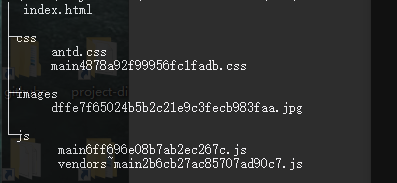

## 配置source-map和manifest.json

- 在打包后的文件中，如果出现异常，堆栈追踪异常不能定位到打包前的单个文件，所以使用source-map。官方推荐开发模式下使用`inline-source-map`, 生产模式使用`source-map`

    > config/webpack.dev.js

        const config = {
            ...
            + devtool: "inline-source-map",
            ...
        }

    > config/webpack.prod.js

        const config = {
            ...
            + devtool: "source-map",
            ...
        }

- manifest

    - 安装

        yarn add webpack-manifest-plugin -D

    - 配置

        > config/webpack.prod.js

            ...
            const ManifestPlugin = require('webpack-manifest-plugin');

            const config = {
                ...
                plugins: [
                    ...
                    new ManifestPlugin(),
                ]
            }

## 配置公共路径

***当我们使用`vue-cli`或者`create-react-app`脚手架打包项目后，未修改publicPath的情况下直接打开`index.html`会报错无法找到js、css静态资源***

***因为脚手架默认的publicPath设置为 `/`，则对应的资源外链都是从服务器路径`/`开始寻找资源***

- 配置

    > config/webpack.common.js

        function webpackCommonConfigCreator(options){
            return {
                ...
                output: {
                    ...
                    + publicPath: "/"
                },
                ...
                module: {
                    rules: [
                        ...
                        {
                            test: /\.(jpg|png|svg|gif)$/,
                            use: [
                                {
                                    loader: 'url-loader',
                                    options: {
                                        limit: 10240,
                                        name: 'images/[hash].[ext]',
                                        + publicPath: "/"
                                    }
                                },
                            ]
                        },
                    ]
                }
            }
        }

- `yarn build`, 打包完成后推荐使用http-server

        yarn global add http-server
        npm install http-server -g

- `http-server build`

    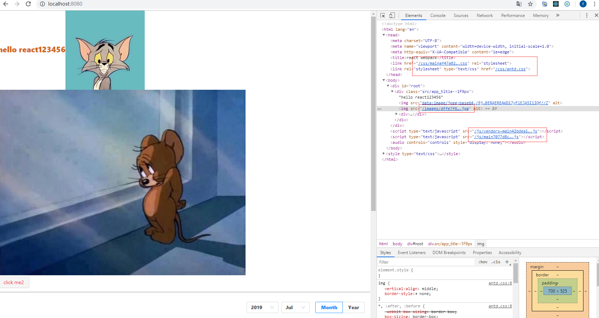